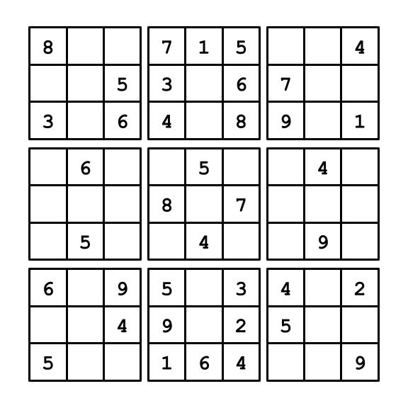

# SudokuSolver
This repository contains a sudoku board solver which utilizes backtracking.

## Usage

Run the main file `SudokuSolver.java`.\
`Usage: java SudokuSolver <filename>`

The file should contain the sudoku puzzle with 'X' where blanks appear.
All characters that are not 'X' and digits 1-9 will be ignored. 
See the `puzzles` folder for example files.

## Future Elaborations
* Improved methods of inputting puzzles. 
* Improved methods of viewing solutions.

## Licence

MIT License\
See LICENSE for details.